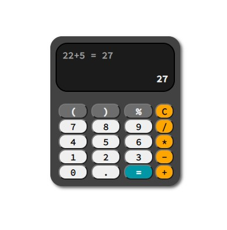

# My Calculator Project

This project was made by [Aurore Van Hoorebeke](https://github.com/AuroreVanHoorebeke).  
It was finished on 18th of November 2020, during my junior webdev training at BeCode.    
## What is it exactly?
In order to learn more about JavaScript, we were asked to create a calculator able to make basic calculations.  
After making the basic calculations, I tried to add more buttons and functionalities, like the calculator's history.
## Languages

- JavaScript
- HTML
- CSS (no framework)

## What have I learned?
I learned how to create multiple HTML tags using JS only.  
I used arrays as well to try and make the code more concise and event listeners to make the buttons work.  

## Known issues  
Even though this project works quite well for the basic calculations, there are still issues I couldn't fix before submitting my work:  
- The % doesn't work, it is considered a a modulus operator.
- The calculator isn't really adapted for really small screens and its dimensions aren't as I want them to be.
- The calculator admits multiple dots and operators instead of displaying just one, the solution I found in the begging was using the "once" option on my event listeners but that meant I could only use the sign once sure the calculation.
- I wanted to reset the display's content while keeping the history when pressing on another number after an operation.
- I wanted to add line breaks between calculations in the history to make it readable.
- After resolving more important issues, I wanted to be able to type the numbers on the numpad instead of clicking on buttons and gets the result with "enter".

## Appearance  
  
Here's what it looks like!  
-> [Online demo](https://aurorevanhoorebeke.github.io/calculator/) <-  